<!-- ============================  BANNER  ============================ -->

  

   

  

   

  
  
  <!-- TODO: add your public email below -->
  
  

 

<!-- ============================  ABOUT  ============================ -->
## About

I am a Cybersecurity Engineering student at Middle Technical University, ranked in the top 2 of my class, focused on blue team operations: detection engineering, threat hunting, and digital forensics and incident response.

I began on the offensive side and moved deliberately toward defense. I build full detection labs end to end, write the SPL and Sigma logic behind them, and map coverage to MITRE ATT&CK. Based in Baghdad, Iraq, I am pursuing entry level SOC and Detection Engineering roles across Iraq and the Gulf region.

- **Role:** SOC Analyst, Detection Engineer
- **Focus:** Detection-as-Code, SIEM engineering, DFIR
- **Currently:** completing the HTB CDSA certification
- **Principle:** every detection should be version controlled, tested, and deployable

 

<!-- ============================  HIGHLIGHTS  ============================ -->
## Highlights

- **1st in Iraq, 11th worldwide** at the Cisco Networking Academy CTF Cup
- **Top 2 of class**, Cybersecurity Engineering, Middle Technical University
- Designed and published **Operation Shadow Grid**, a 7 VM Splunk SIEM detection lab

 

<!-- ============================  CERTS  ============================ -->
## Training and Certifications

| Training and Courses | Certifications |
| :--- | :--- |
| CCNA (Cisco Networking Academy) | eJPT (INE / eLearnSecurity) |
| LetsDefend SOC and SIEM paths | eCPPT (INE / eLearnSecurity) |
| HTB CDSA (in progress) | eCIR, Incident Response |
| Earthlink Telecom, summer training | eCTHP, Threat Hunting |
| | ICCA |

 

<!-- ============================  SKILLS  ============================ -->
## Technical Skills

**SIEM and Log Analytics**

-0F172A?style=flat-square&logo=elasticsearch&logoColor=22D3EE)

**Detection and Threat Hunting**

**DFIR and Blue Team**

**Languages and Platforms**

 

<!-- ============================  PROJECT  ============================ -->
## Featured Project

### Operation Shadow Grid

A 7 VM Splunk SIEM detection lab simulating a full enterprise attack chain, from reconnaissance through DNS tunneling exfiltration, with detection at every phase.

- 15 custom SPL detection rules, mapped to MITRE ATT&CK
- 5 dashboards and an ATT&CK Navigator heatmap
- Stack: pfSense, Active Directory, Sysmon, Universal Forwarders, Zeek, Suricata
- Network architecture diagram and full detection rules catalog

[View the repository](https://github.com/err0rKhalifa/Operation-Shadow-Grid)

 

 

<!-- ============================  STATS  ============================ -->
## GitHub Statistics

  
  

 

<!-- ============================  GOALS  ============================ -->
## Current Focus and Goals

1. Complete the HTB CDSA certification
2. Build an IBM QRadar detection project, Operation Iron Curtain
3. Develop a Detection-as-Code pipeline for version controlled, testable detections
4. Pursue SOC and Detection Engineering roles across Iraq and the Gulf region

My aim is to treat every detection as code: version controlled, tested, and deployable, in line with where modern SOC operations are heading.

 

<!-- ============================  CONTACT  ============================ -->

## Contact

Open to SOC Analyst, Detection Engineering, and Blue Team opportunities in Iraq and the Gulf.

