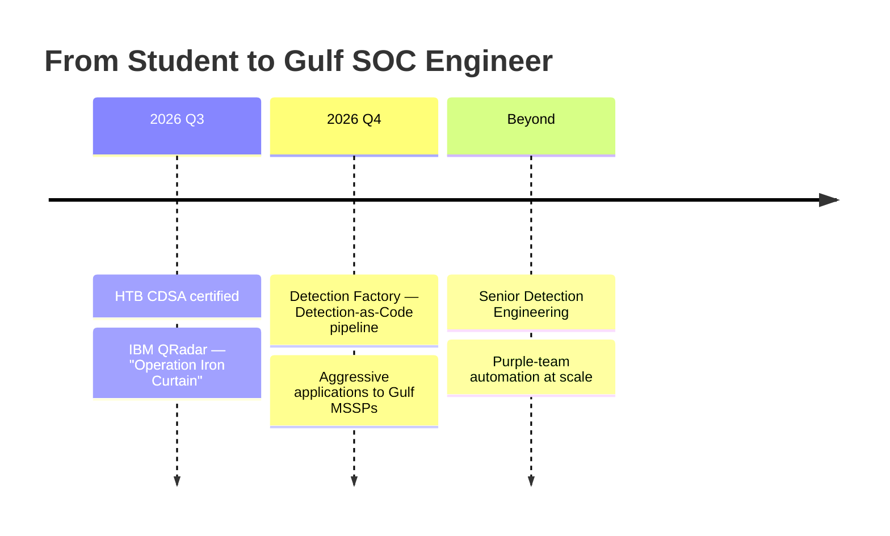

<!-- ═══════════════════════════════  HERO BANNER  ═══════════════════════════════ -->
<div align="center">

  <a href="https://github.com/err0rKhalifa">
    
  </a>

  <!-- Animated role typer -->
  <a href="https://github.com/err0rKhalifa">
    
  </a>

  <br/>

  <!-- Social + meta badges -->
  <a href="https://www.linkedin.com/in/ahmed-ali-khalifa-2a46753a3/">
    
  </a>
  <a href="https://github.com/err0rKhalifa">
    
  </a>
  <!-- TODO: replace with your public email -->
  <a href="mailto:your.email@example.com">
    
  </a>
  
  <br/>
  

</div>

<br/>

<!-- ═══════════════════════════════════  ABOUT  ═══════════════════════════════════ -->
## 🛡️ whoami

```yaml
name:        Ahmed Ali Khalifa
alias:       "Error"  (err0rKhalifa)
role:        Cybersecurity Engineering Student → SOC Analyst / Detection Engineer
location:    Baghdad, Iraq  🇮🇶
university:  Middle Technical University — B.Sc. Cybersecurity Technology Engineering
standing:    Top 2 of class
mindset:     "Building and breaking things to understand how they work."
```

I started on the **offensive** side and moved deliberately toward the **blue team** — detection engineering, DFIR, and SOC operations — because I love the moment where an attack meets a well-written rule and lights up on a dashboard. I build full detection labs end-to-end, write the SPL/Sigma behind them, and map everything to **MITRE ATT&CK**.

- 🔭 Right now: finishing **HTB CDSA**, then shipping an **IBM QRadar** detection project and a **Detection-as-Code** pipeline.
- 🌱 Learning deeper: threat hunting with Elastic, Windows attack/defense, network traffic analysis.
- 🎯 Goal: entry-level **SOC / Detection Engineering** roles across Iraq and the **Gulf MSSP** scene.
- ⚡ Off the clock: **Valheim**, and progressive-overload training in the gym.

<br/>

<!-- ═══════════════════════════════  ACHIEVEMENTS  ═══════════════════════════════ -->
## 🏆 Highlights

<table>
  <tr>
    <td align="center" width="33%">
      <br/>
      <b>#11 Worldwide · #1 in Iraq</b><br/>
      <sub>Cisco Networking Academy CTF Cup</sub>
    </td>
    <td align="center" width="33%">
      <br/>
      <b>Top 2 of Class</b><br/>
      <sub>Cybersecurity Eng. — MTU</sub>
    </td>
    <td align="center" width="33%">
      <br/>
      <b>7-VM SIEM Detection Lab</b><br/>
      <sub>Operation Shadow Grid — public</sub>
    </td>
  </tr>
</table>

<br/>

<!-- ══════════════════════════════  CERTS & TRAINING  ══════════════════════════════ -->
## 🎓 Training &nbsp;·&nbsp; 📜 Certifications

<table>
  <tr>
    <th align="left" width="50%">📚 Training &amp; Courses</th>
    <th align="left" width="50%">📜 Certifications</th>
  </tr>
  <tr valign="top">
    <td>

- 🌐 **CCNA** — Cisco Networking Academy
- 🔵 **LetsDefend** — SOC & SIEM paths
- 🧪 **HTB CDSA** — *in progress*
- 🏢 **Earthlink Telecom** — Summer Training

    </td>
    <td>


    </td>
  </tr>
</table>

<br/>

<!-- ══════════════════════════════════  ARSENAL  ══════════════════════════════════ -->
## 🧰 Tech Arsenal

**SIEM · EDR · Log Analytics**


-005571?style=for-the-badge&logo=elasticsearch&logoColor=white)


**Detection · Threat Hunting**


**DFIR · Blue Team**


**Languages & Platforms**


<br/>

<!-- ═══════════════════════════════  FEATURED WORK  ═══════════════════════════════ -->
## 🚀 Featured Project

<a href="https://github.com/err0rKhalifa/Operation-Shadow-Grid">
  
</a>

### ⚡ Operation Shadow Grid
A full **7-VM Splunk SIEM detection lab** simulating a complete enterprise attack chain — recon to DNS-tunneling exfiltration — and catching every phase.

- **15** custom SPL detection rules, all mapped to **MITRE ATT&CK**
- **5** dashboards + an ATT&CK Navigator heatmap
- Stack: **pfSense · Active Directory · Sysmon · Universal Forwarders · Zeek · Suricata**
- Network architecture diagram + full detection-rules catalog

➡️ **[Explore the repo](https://github.com/err0rKhalifa/Operation-Shadow-Grid)**

<br clear="left"/>

<br/>

<!-- ══════════════════════════════════  STATS  ══════════════════════════════════ -->
## 📊 GitHub Stats

<div align="center">

  
  

  

  <br/><br/>

  

  <br/><br/>

  

</div>

<br/>

<!-- ═══════════════════════════════  THE ROADMAP  ═══════════════════════════════ -->
## 🧭 What I'm Building Toward



> **The thesis:** every detection I write should be version-controlled, tested, and deployable like software. Detection-as-Code isn't a buzzword to me — it's the direction the whole SOC is moving, and I intend to get there early.

<br/>

<!-- ══════════════════════════════════  CONNECT  ══════════════════════════════════ -->
<div align="center">

## 🤝 Let's Connect

I'm open to **SOC Analyst**, **Detection Engineering**, and **Blue Team** opportunities in Iraq and the Gulf.

<a href="https://www.linkedin.com/in/ahmed-ali-khalifa-2a46753a3/"></a>
<a href="https://github.com/err0rKhalifa"></a>
<a href="mailto:your.email@example.com"></a>

<br/><br/>


<sub><i>root@baghdad:~$ ./detect --always</i></sub>

</div>
